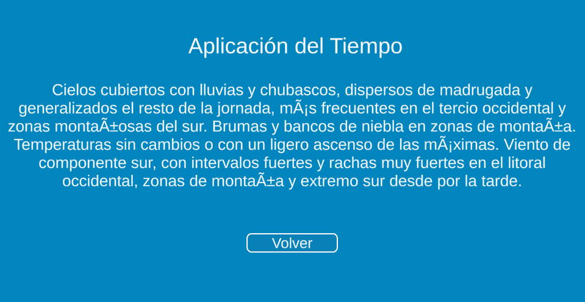

# Prueba VT-Lab

Prueba de Desarrollo en Unity: Integración de Interfaz de Usuario, API y Scripts

Introducción:
En esta prueba, se evaluarán tus habilidades en el desarrollo de interfaces de usuario en Unity, la manipulación de datos a través de scripts y la integración con una API externa.

Instrucciones:

## Parte 0: Setup de la escena

0.1 Adjunta el script "InterfaceController" como creas adecuado en la escena y asígnale los objetos que vayas a utilizar a los campos vacíos.

## Parte 1: Creación de la Interfaz de Usuario

1.1 Crea una interfaz de usuario similar a la proporcionada en la imagen "Captura_Weather_Panel" (el campo del tiempo puede estar vacío por ahora, no debe tener todo ese texto).

## Parte 2: Modificación del Script Existente

2.1 Modifica el script existente proporcionado para que en la función "populateDropdown" el objeto Dropdown se llene dinámicamente con los datos del diccionario "provinceWithId".

## Parte 3: Integración con API

3.1. Implementa la lógica necesaria para enviar una solicitud a la API del tiempo cuya página web es: https://www.el-tiempo.net/api, utilizando el valor correspondiente al elemento seleccionado en el Dropdown como clave del diccionario.

3.2. Maneja la respuesta de la API de manera adecuada y captura el valor relevante, que se usará en la función "writeWeather".

## Parte 4: Gestión de Interfaces

4.1. Añade los listeners necesarios a los botones mediante código.

4.2. Rellena el objeto "resultText" en la nueva interfaz con el valor recibido de la API, haz uso de la función "writeWeather".

4.3. Cierra la interfaz actualmente abierta y abre la nueva, mostrando el tiempo.

## Parte 5: Vuelta al Inicio

5.1 Asegúrate de que el botón salir de la interfaz te devuelve a la pantalla principal y puedes realizar otra búsqueda sin problemas.

## Anotaciones: 

> Se deben utilizar las definiciones de las funciones creadas, no se pueden modificar los nombres ni los parámetros, sólo añadir código dentro de ellas.
>
> Las provincias NO están en el orden de su ID, por ejemplo, A Coruña es la primera provincia que se coloca pero su ID no es la 01.